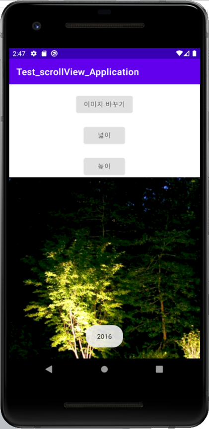

# 19173063 김수민

## 1주차 과제

## 2주차 과제
   </img>

## 3주차 과제
   </img>
   </img>
   </img>
  
## 4주차 과제

## 7주차 과제
   </img>
   </img>
   
## 9 주차과제
   </img>
   </img>
   </img>
   </img>
   <소스코드>
   package com.example.test_scrollview_application;

import androidx.appcompat.app.AppCompatActivity;

import android.content.res.Resources;
import android.graphics.drawable.BitmapDrawable;
import android.os.Bundle;
import android.view.View;
import android.widget.ImageView;
import android.widget.ScrollView;
import android.widget.Toast;

public class MainActivity extends AppCompatActivity {

    ScrollView scrollView;
    ImageView imageView;
    BitmapDrawable bitmap;
    String temp;
    String temp1;

    @Override
    protected void onCreate(Bundle savedInstanceState) {
        super.onCreate(savedInstanceState);
        setContentView(R.layout.activity_main);

        scrollView=findViewById(R.id.verScrollView);
        imageView=findViewById(R.id.imageView);
        scrollView.setHorizontalScrollBarEnabled(true);

        Resources res=getResources();
        bitmap=(BitmapDrawable) res.getDrawable(R.drawable.image01);
        int bitmapWidth=bitmap.getIntrinsicWidth();
        int bitmapHeight=bitmap.getIntrinsicHeight();
        temp=Integer.toString(bitmapWidth);
        temp1=Integer.toString(bitmapHeight);

        imageView.setImageDrawable(bitmap);
        imageView.getLayoutParams().width=bitmapWidth;
        imageView.getLayoutParams().height=bitmapHeight;
    }
    public void btnClicked(View v)
    {
        changImage();
    }
    public void btnWClicked(View v)
    {
        Toast.makeText(this,temp,Toast.LENGTH_SHORT).show();
    }
    public void btnHClicked(View v)
    {
        Toast.makeText(this,temp1,Toast.LENGTH_SHORT).show();
    }
    private void changImage()
    {
        Resources res=getResources();
        bitmap=(BitmapDrawable) res.getDrawable(R.drawable.image02);
        int bitmapWidth=bitmap.getIntrinsicWidth();
        int bitmapHeight=bitmap.getIntrinsicHeight();
        temp=Integer.toString(bitmapWidth);

        imageView.setImageDrawable(bitmap);
        imageView.getLayoutParams().width=bitmapWidth;
        imageView.getLayoutParams().height=bitmapHeight;
    }
}
     
